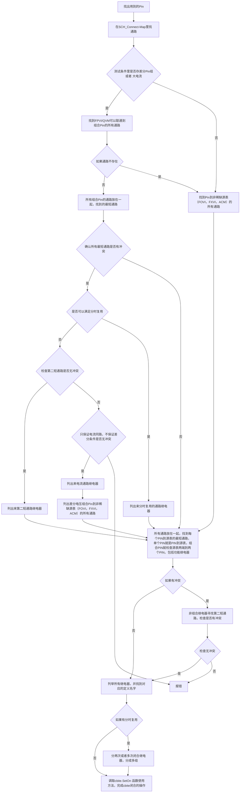

# 继电器通路设计流程（relay-design-flow）— 用户权威定稿 2026-09-02

- 来源：用户飞书白板流程图（Mermaid，2026-09-02 提供，连线完整版）
- 铁律：每个新 TM 的继电器设计**必须重走本流程**，禁止直接复制黄金案例的继电器结构（黄金案例只作"同构参照"，不照抄模板）
- 最终验收（用户最新裁决）：流程节点用于生成与调整组合，不逐步增加人工验收。最终只验选中源表到 PIN 连通、Force/Sense 两路均有效、Force 与 Sense 不要求同一 CBIT 同时 ON/OFF、两个不同 PIN 不同时占用同一源表的同一端、所需功能继电器齐全。输入哈希与产物有效性仍须正常校验；同 PIN 的 Force/Sense 正常共用不属于两个 PIN 冲突。
- 关联：`path-principles.md`（找通路三原则 + ②'Pin2Pin + 冲突降级）、`relay-checklist.md`（闭合顺序/功能规则）、`agents/relay-agent.md`

## 一、节点速览（每个节点的含义）

| 节点 | 含义 |
|---|---|
| **I** | 找出测试用到的全部 Pin |
| **J** | 在 SCH_Connect-Map 里找通路 |
| **N** | 判断：测试条件里是否存【差分 Pin 组 或 大电流】？ |
| **S** | 找 FPVI/QVM 可以联通到组合 Pin 的所有通路（差分/大电流走稀缺源表） |
| **K** | 找 Pin 到非稀缺源表（FOVI/FXVI/ACM）的所有通路 |
| **W** | 判断：如果 FPVI/QVM 通路不存在？ |
| **D** | 所有组合 Pin 的通路放在一起，找到最短通路 |
| **C** | **最短通路选择汇总**：所有通路放一起，找每个 PIN 到源表的最短通路（单 PIN=PIN 到源表；组合 PIN=检查源表两端到两个 PIN，含功能继电器） |
| **T** | 判断：确认所有最短通路是否有冲突？ |
| **X** | 判断：是否可以满足分时复用？ |
| **L** | 列出来分时复用的通路继电器 |
| **E** | 判断：检查第二短通路是否无冲突？ |
| **R** | 列出来第二短通路继电器 |
| **P** | 判断：只保证电流同路，不保证差分条件是否无冲突？ |
| **O** | 列出来电流通路继电器 |
| **U** | 列出差分电压组合 Pin 到非稀缺源表（FOVI/FXVI/ACM）的所有通路 |
| **B** | 判断：如果有冲突（全局/含功能继电器）？ |
| **M** | 非组合继电器寻找第二短通路，检查是否有冲突 |
| **G** | 判断：检查无冲突？ |
| **A** | 列举所有继电器，并找到对应的定义名字 |
| **Q** | 判断：如果有分时复用？ |
| **H** | 分两次或者多次闭合继电器，分成多组 |
| **V** | 调取 cbite.SetOn 函数使用方法，完成 cbite 闭合的操作（**终点**） |
| **F** | 报错（不可解，阻塞裁决） |

## 二、主线流程（步骤化）

```
① 找 Pin　　I
　　↓
② 找通路　　J （在 SCH_Connect-Map 里找通路）
　　↓
③ 分流判断　N: 测试条件里是否存【差分 Pin 组 或 大电流】?
　　├─【是】→ S: 找 FPVI/QVM → 组合 Pin 的所有通路
　　│　　　　↓ W: 如果通路不存在?
　　│　　　　├─【是(不存在)】→ K: 改找非稀缺源表通路
　　│　　　　└─【否(存在)】→ D: 组合 Pin 通路放一起取最短 → T
　　└─【否】→ K: 找 Pin 到非稀缺源表（FOVI/FXVI/ACM）的所有通路
　　↓
④ 最短通路选择　C: 所有通路放一起，找每个 PIN 到源表最短通路
　　（单PIN=PIN到源表；组合PIN=检查源表两端到两个PIN，含功能继电器）
　　（K/C、D→T、U→C 都会回流到 C 重新汇总）
　　↓
⑤ 冲突检查　　T: 确认所有最短通路是否有冲突?
　　├─【是】→ X: 是否可以满足分时复用?
　　│　　　├─【是】→ L: 列出分时复用通路继电器 → 回 C
　　│　　　└─【否】→ E: 检查第二短通路是否无冲突?
　　│　　　　　├─【是】→ R: 列第二短通路继电器 → 回 C
　　│　　　　　└─【否】→ P: 只保证电流同路、放弃差分，是否无冲突?
　　│　　　　　　　├─【是】→ O: 列电流通路继电器 → U: 列差分电压组合到非稀缺源表通路 → 回 C
　　│　　　　　　　└─【否】→ F: 报错
　　└─【否】→ 回 C（继续汇总评估）
　　↓
⑥ 全局冲突　　C → B: 如果有冲突（含功能继电器）?
　　├─【否】→ A: 列举所有继电器 + 找定义名 → Q
　　└─【是】→ M: 非组合继电器找第二短通路，检查冲突
　　├─ G: 检查无冲突?
　　│　├─【是】→ A → Q
　　│　└─【否】→ F: 报错
　　↓
⑦ 分时复用　　Q: 如果有分时复用?
　　├─【是】→ H: 分两次/多次闭合继电器，分成多组 → V
　　└─【否】→ V
　　↓
⑧ 终点　　　　V: 调取 cbite.SetOn 用法 → 完成闭合操作
```

## 三、关键要点（执行时注意）

1. **分流依据（N）**：测试条件含「差分 Pin 组 / 大电流」→ 优先稀缺源表 FPVI/QVM；否则走非稀缺源表（FOVI/FXVI/ACM）。
2. **最短通路的两种情形（C）**：
   - **单 PIN**：该 PIN 到源表的最短通路
   - **组合 PIN（差分）**：检查**源表两端分别到两个 PIN** 的通路，**并集继电器数**最短，**含功能继电器**（Cap/PU/P2P 等）
3. **冲突降级链（⑤）**：最短通路冲突 → **分时复用**（首选）→ **第二短通路** → **放弃差分只保电流**（最后容忍）→ 都不可行才**报错**。符合"本电路可满足则不裁决，缺失才阻塞"原则。
4. **全局检查（⑥）**：组合通路选定后，再从全部继电器集合层面检查有无冲突；非组合继电器冲突则换第二短。
5. **终点（⑧）**：必须**先查 cbite.SetOn 使用方法**（CBITe.h：`BYTE SetOn(int k1, ...)` 变参、`-1` 结束、**全量设置=先清后设只闭列出**）再写闭合调用；有分时复用则分多组**多次 SetOn**。
6. **回流机制**：K、D(T)、L、R、U 的解决结果都会**回到 C 重新汇总**评估最短通路，直至无冲突进入 B。

## 五、执行案例：TM1205（TRX_BST_UV_GD，2026-09-02 按流程重走）

> 目的：演示本流程在真实 TM 上的完整落地，作为后续新 TM 的参照。

| 流程步 | 本案例执行 | 结论 |
|---|---|---|
| **① 找 Pin** | VBAT / BST1 / BST2 / SW1 / SW2 / nQON；差分对 = BST1−SW1、BST2−SW2 | 6 个 Pin，2 个差分对 |
| **② 找通路** | 地图列2(FPVIe)/列6(ACM200)：BST1/2 有 FPVIe Low(K41/K41+K43)、SW1/2 有 High(K46/K46+K49)→Low(K47/K47+K50)；BST1/2 无 FPVIe High 端 | 关键：BST 侧只有 Low 端 → 差分须 High→SW + Low→BST |
| **③ 分流 N** | BST1−SW1、BST2−SW2 均差分 → 是；VBAT/nQON 单 Pin → 否 | 差分走 FPVI/QVM；单 Pin 走非稀缺 |
| **④ 最短 D/C** | 路1={K46,K41}；路2={K46,K49,K41,K43}；VBAT=FXVI(K8 默认NC)；nQON=K65_PU | 组合 Pin 并集最短，含功能继电器 |
| **⑤ 冲突 X** | 路1/路2 都占 FPVI0 同一差分通道 → 通道冲突 | 可**分时复用**（先路1后路2，换 DMUX 57→58） |
| **⑥ 全局 B/G** | 分时后继电器无额外冲突 | 无冲突 → 列举继电器 |
| **⑦ 分时 Q** | 有 → 分两组 | 两组各独立 SetOn |
| **⑧ 终点 V** | 按 CBITe.h 全量语义 → 分组独立 SetOn | 路2 必须**重新 SetOn**（勿把两组宏合并进一次 SetOn → 会并联） |

```cpp
// 组1 - 路1 (BST1-SW1): 全量设置只闭路1宏
cbite.SetOn(K_FPVIH_TO_SW1_A, K_FPVIL_TO_BST1_A, K13_VBAT_Cap, K65_nQON_PU, -1);
delay_ms(3);
// ... 测路1 (DMUX 57) ...
// 组2 - 路2 (BST2-SW2): 重新 SetOn 切路 (K43/K49 NC→ON 选 BST2/SW2)
cbite.SetOn(K_FPVIH_TO_SW2_A, K_FPVIL_TO_BST2_A, K13_VBAT_Cap, K65_nQON_PU, -1);
delay_ms(3);
// ... 测路2 (DMUX 58) ...
```

**⚠️ 易错点（本次教训）**：把路1+路2 两组宏合并进**一次** `cbite.SetOn(...)` 会让两路并联（K43/K49 同闭）。SetOn 是**全量设置**（先清后设、只闭列出），分时场景必须**每组一次独立 SetOn**。

## 四、原始 Mermaid（存档）


